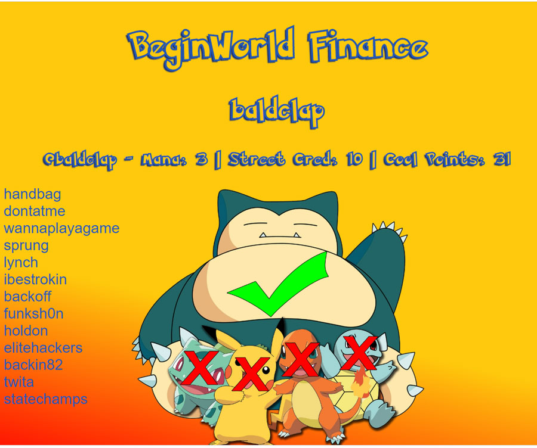
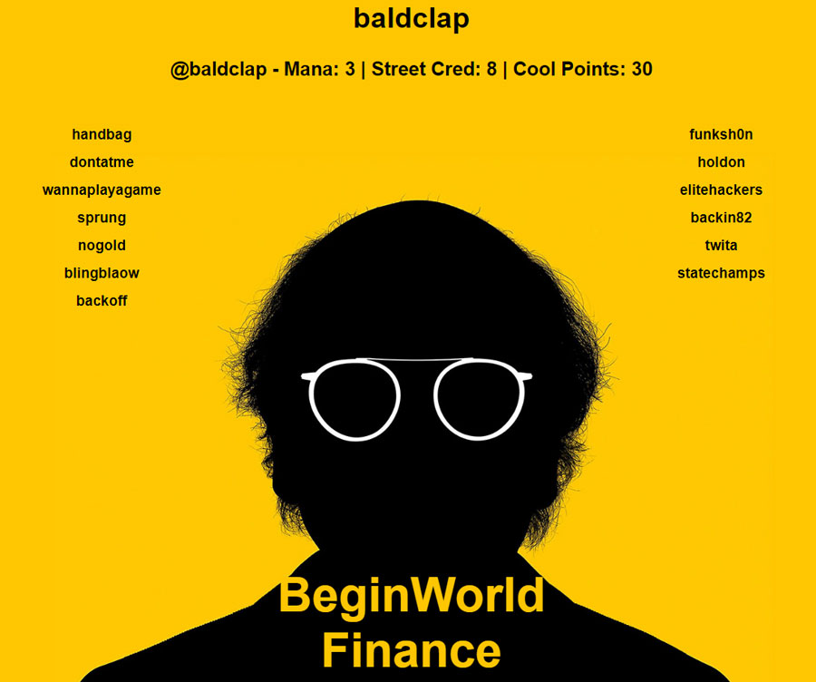
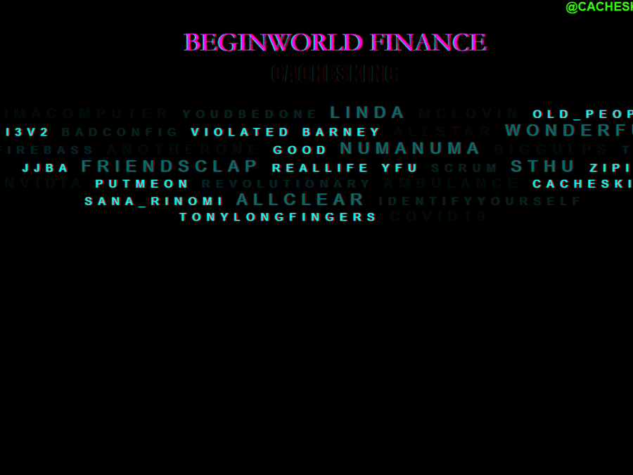
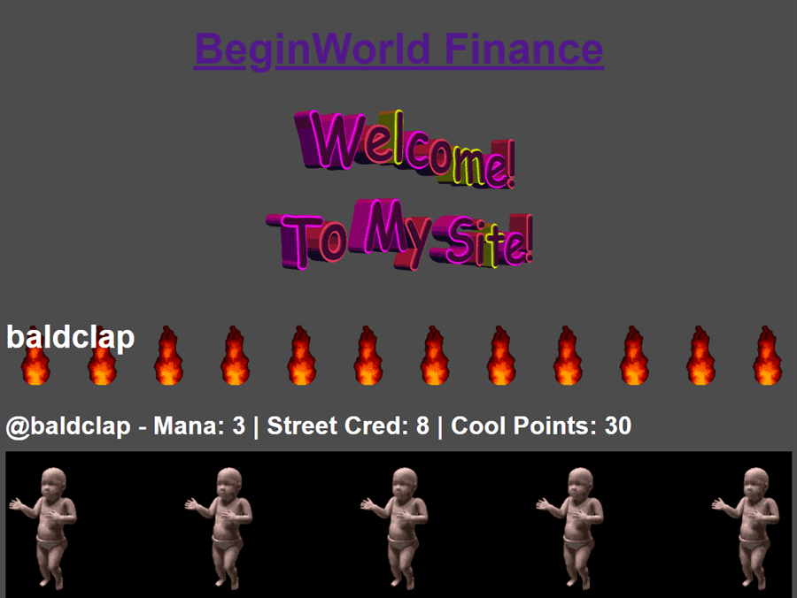
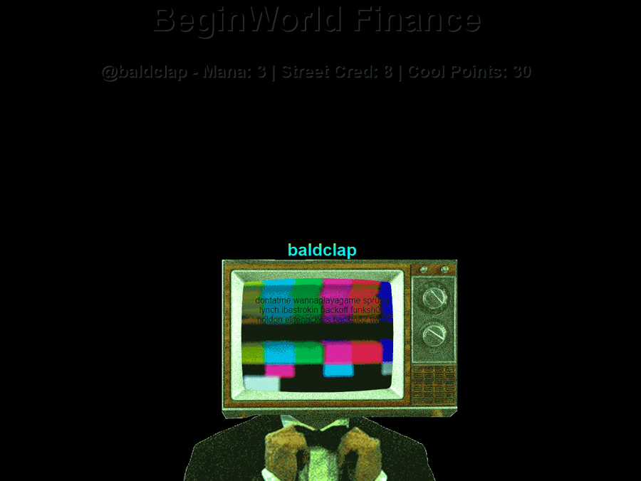
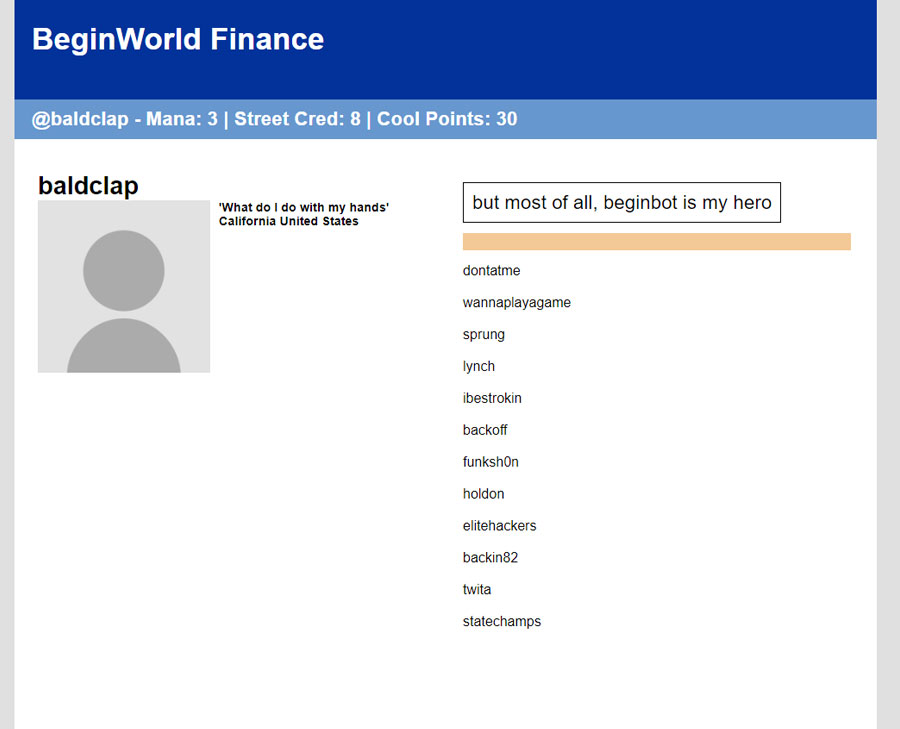
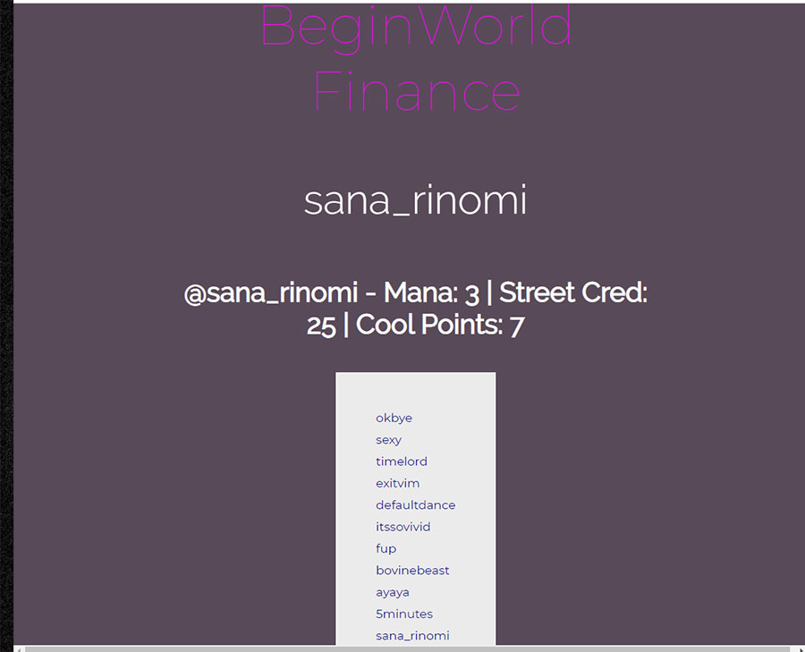
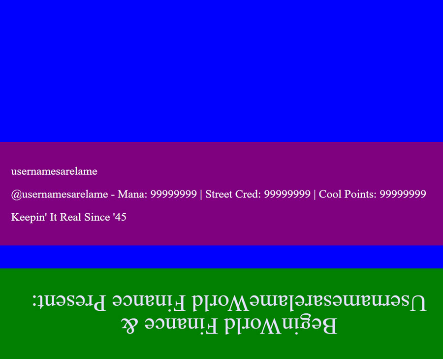
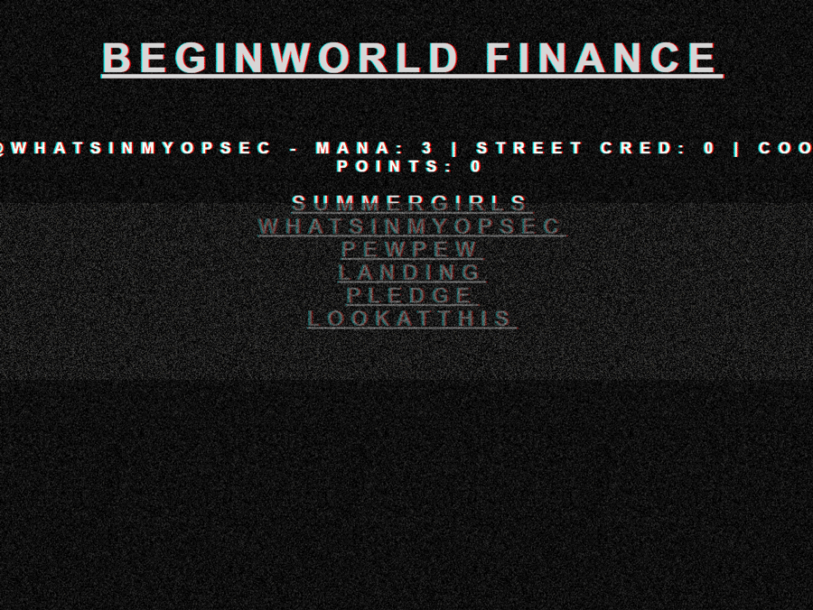
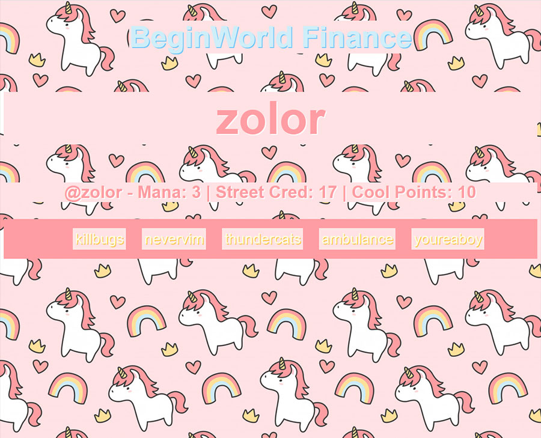

# BEGINLAND THEME STORE

This is the non-profit organization dedicated to providing free themes and CSS hosting for [Beginland](https://mygeoangelfirespace.city/). Feel free to fork and submit your own CSS Themes [here](https://github.com/dillonupgradeit/css-fun/tree/gh-pages) to be hosted and shared.

To use any of these themes as your own Beginland theme, grab the URL below and type '!css [INSERT URL]' in BeginBot chat (without the '' and []). Example: !css https://dillonupgradeit.github.io/css-fun/myspace.css

Donate: This org is entirely run on donations. Your donations are greatly appreciated. Please address all Street Cred/Cool Point/Sound donations to the artist directly. 

## Borlax
*artist: @baldclap*
URL: https://dillonupgradeit.github.io/css-fun/borlax.css

## Curb
*artist: @baldclap*
URL: https://dillonupgradeit.github.io/css-fun/curbyourenthusiasm.css

## Cachesking 1 (animated)
*artist: @cachesking*
URL: https://dillonupgradeit.github.io/css-fun/cachesking1.css

## Geocities (animated)
*artist: @baldclap*
URL: https://dillonupgradeit.github.io/css-fun/geocities.css

## MrRobot (animated)
*artist: @baldclap*
URL: https://dillonupgradeit.github.io/css-fun/mrrobot.css

## Myspace
*artist: @baldclap*
URL: https://dillonupgradeit.github.io/css-fun/myspace.css

## Sana_Rinomi 1
*artist: @sana_rinomi*
URL: https://dillonupgradeit.github.io/css-fun/sanarinomi.css

## Usernamesarelame 1
*artist: @usernamesarelame*
URL: https://dillonupgradeit.github.io/css-fun/usernamesarelame1.css

## Whatsinmyopsec 1 (animated)
*artist: @whatsinmyopsec*
URL: https://dillonupgradeit.github.io/css-fun/whatsinmyopsec1.css

## Zolor 1
*artist: @zolor*
URL: https://dillonupgradeit.github.io/css-fun/zolor1.css
