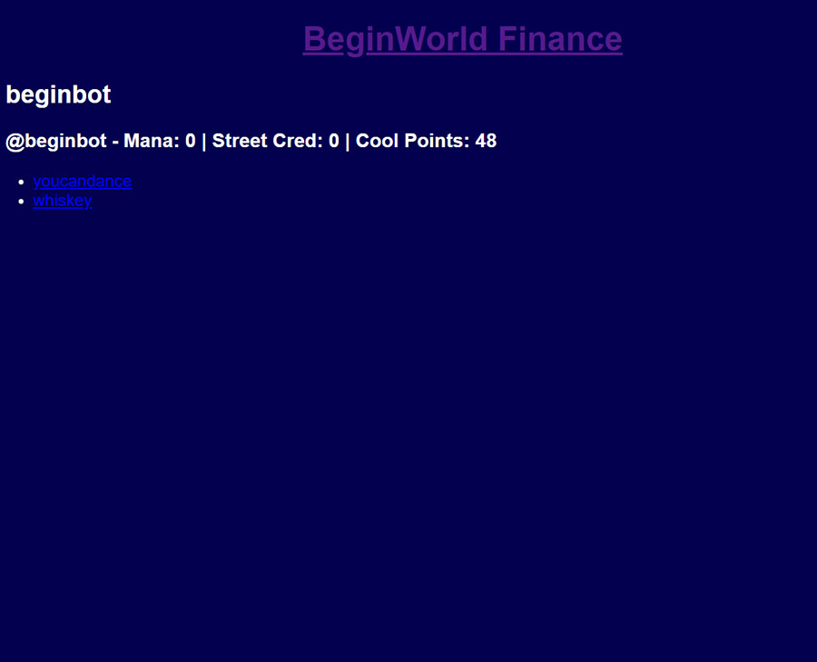
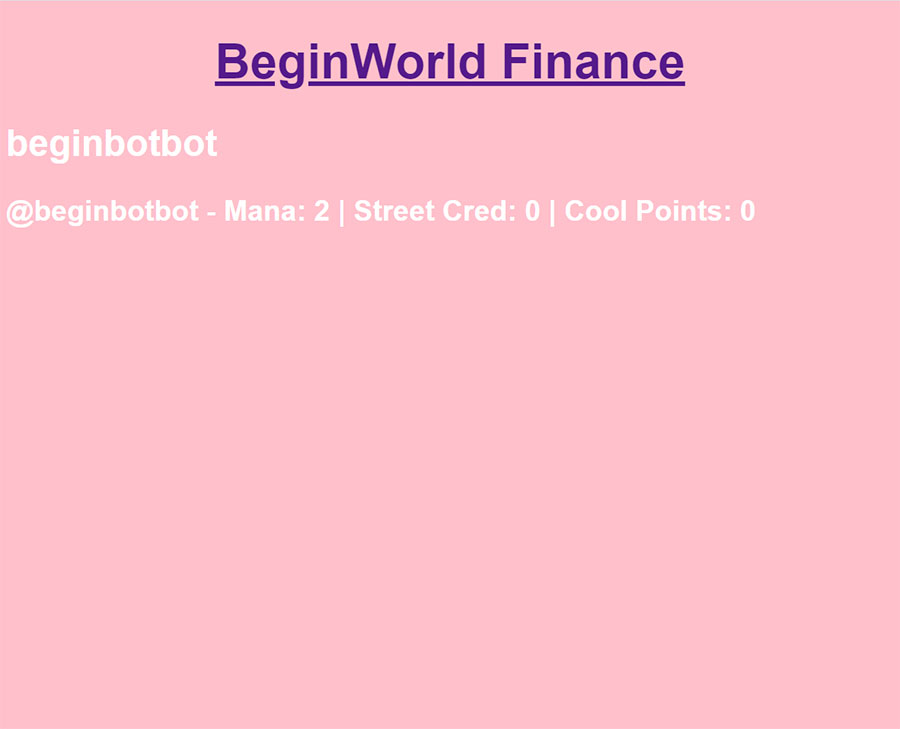

# BEGINLAND CSS ORG

This is the non-profit organization dedicated to providing free themes and CSS hosting for Beginland (https://www.beginworld.exchange). Feel free to fork and submit your own themes to be hosted and shared here.

To use any of these themes as your own Beginland theme, grab the URL below and type '!css [INSERT URL]' in BeginBot chat (without the '' and []). Example: !css https://dillonupgradeit.github.io/css-fun/myspace.css

Donate: This org is entirely run on donations. Your donations are greatly appreciated. Please address all Street Cred/Cool Point/Sound donations to the artist directly. 

## Baldclap 1 (animated)
*artist: @baldclap*
https://dillonupgradeit.github.io/css-fun/baldclap1.css

## Beginbot 1
*artist: @beginbot*
https://dillonupgradeit.github.io/css-fun/beginbot1.css

## Beginbotbot 1
*artist: @beginbotbot*
https://dillonupgradeit.github.io/css-fun/beginbotbot1.css

## Cachesking 1 (animated)
*artist: @cachesking*
https://dillonupgradeit.github.io/css-fun/cachesking1.css

## Myspace
*artist: @baldclap*
https://dillonupgradeit.github.io/css-fun/myspace.css

## Sanari_Nomi 1
*artist: @sanari_nomi*
https://dillonupgradeit.github.io/css-fun/sanarinomi.css

## Usernamesarelame 1
*artist: @usernamesarelame*
https://dillonupgradeit.github.io/css-fun/usernamesarelame1.css

## Whatsinmyopsec 1 (animated)
*artist: @whatsinmyopsec*
https://dillonupgradeit.github.io/css-fun/whatsinmyopsec1.css

## Zolor 1
*artist: @zolor*
https://dillonupgradeit.github.io/css-fun/zolor1.css
